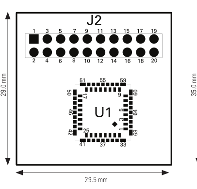

# Lepton breakout board connections

## Breakoutboard

## Raspberry Pi GPIO

| Lepton Breakout Board      | Raspberry Pi |
| :-----------:| :-----------: |
| J2-2 VIN    | 3V3        |
| J2-1 GND    | GND        |
| J2-5 SDA    | SDA1       |
| J2-8 SCL    | SCL1       |
| J2-7 SPI_CLK| SPI0_CLK   |
| J2-10 SPI_CS| SPI_CE0_N  |
| J2-12 SPI_MISO| SPI_MISO |
